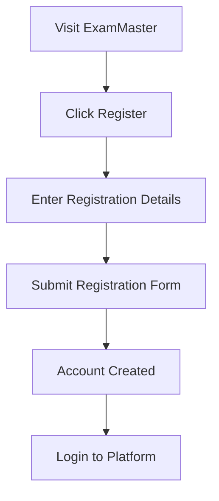
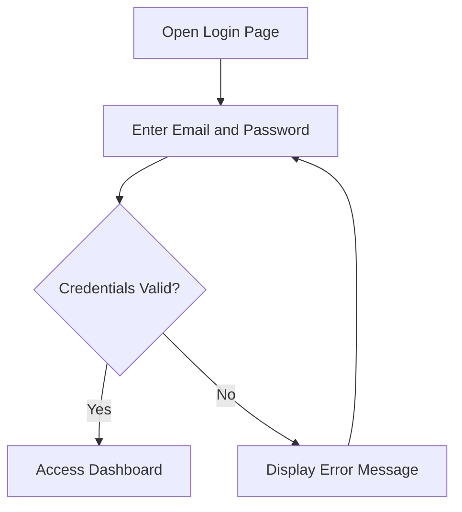
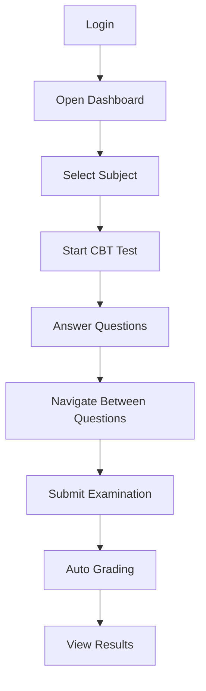
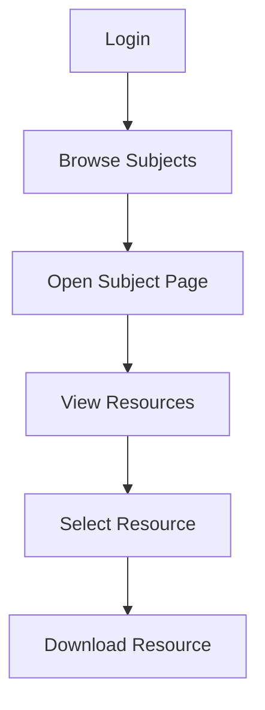
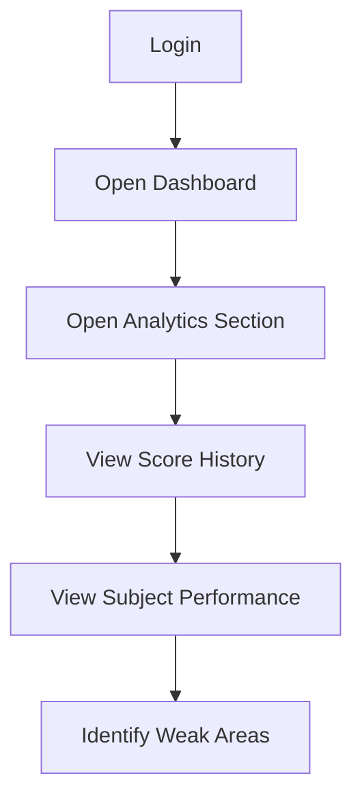
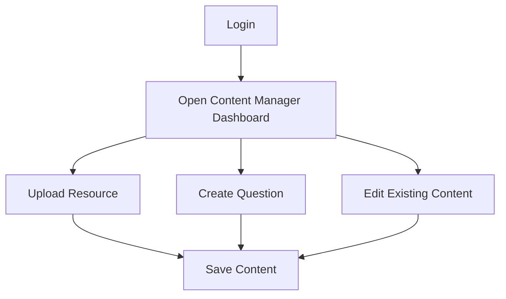
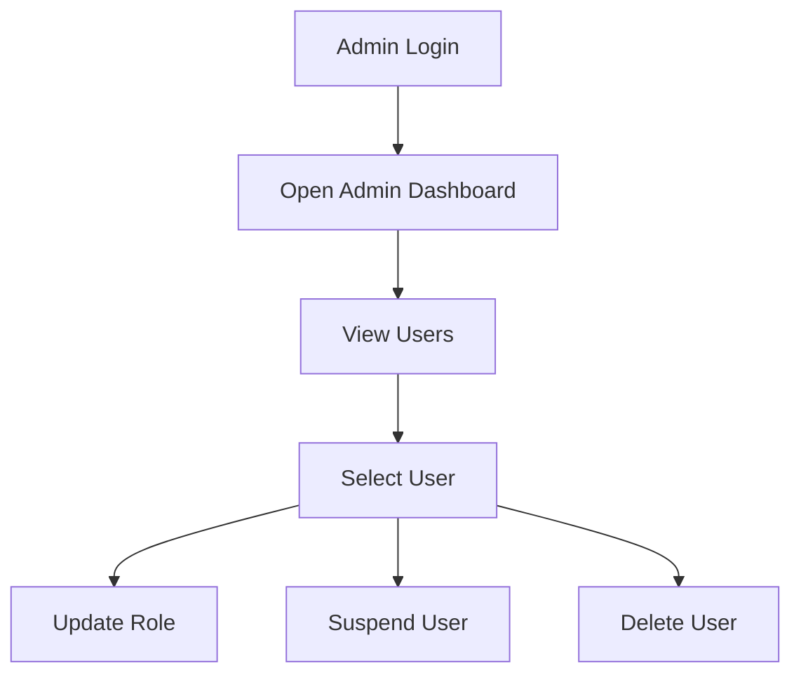
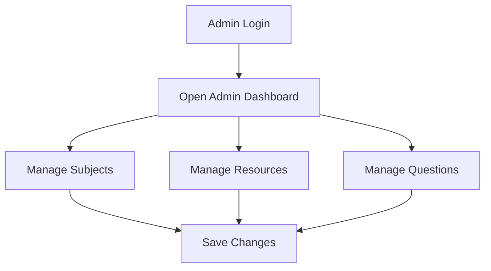
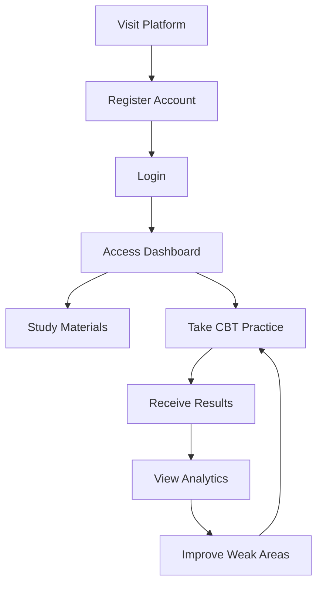

# User Flows

## Overview

This document describes how users interact with the ExamMaster platform. User flow diagrams help visualize the journey users take when performing specific actions within the system.

---

# Student Registration Flow

---

# Student Login Flow

---

# Student CBT Examination Flow

---

# Resource Download Flow

---

# Performance Analytics Flow

---

# Content Manager Flow

---

# Admin User Management Flow

---

# Admin Content Management Flow

---

# Complete Student Journey

---

# System Flow Summary

## Student

- Register
- Login
- Access Dashboard
- Study Materials
- Take CBT Exams
- View Results
- Monitor Performance

## Content Manager

- Login
- Upload Resources
- Create Questions
- Update Content

## Admin

- Login
- Manage Users
- Manage Subjects
- Manage Resources
- Manage Questions
- View Analytics